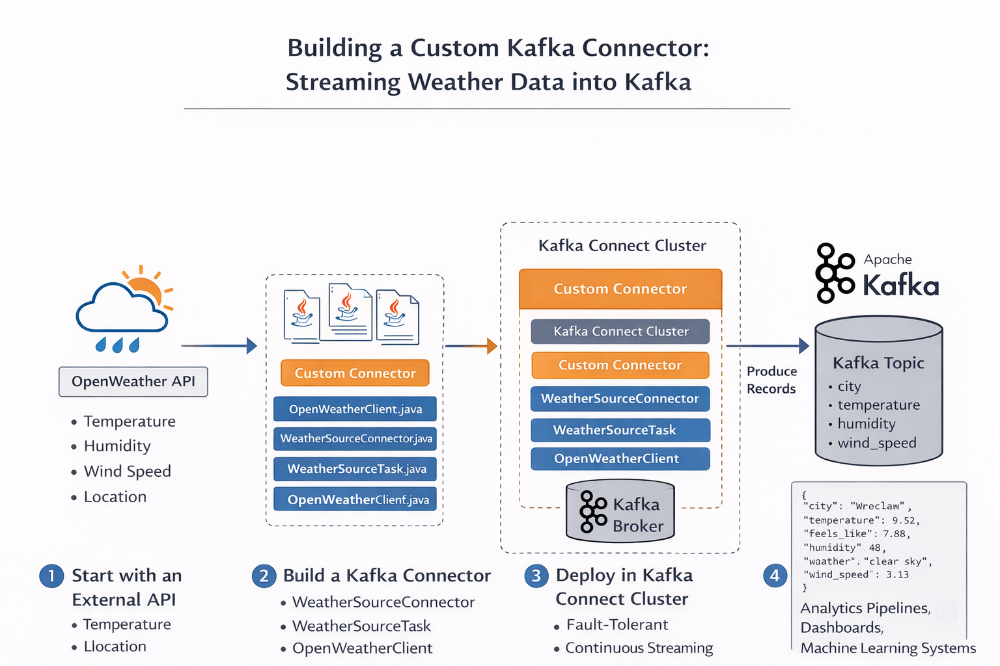

# 🌦️ Kafka OpenWeather Source Connector

A **custom Kafka Source Connector** that periodically fetches weather data from the **OpenWeather API** and streams it into **Apache Kafka** topics using **Kafka Connect**.

This project demonstrates how to build, package, and deploy a **custom Kafka Connect Source Connector written in Java** using the **Confluent Kafka Connect framework**.

---

# 🚀 Project Overview

Modern data architectures often need to ingest data from **external APIs** into streaming platforms.

Instead of writing a standalone producer, **Kafka Connect** provides a scalable and fault‑tolerant way to ingest external data sources.

This connector:

1. Polls the OpenWeather API
2. Extracts useful weather attributes
3. Transforms them into structured Kafka records
4. Publishes them to a Kafka topic

---

# 🏗 Architecture

OpenWeather API
       │
       ▼
Custom Java Connector
(WeatherSourceConnector + Task)
       │
       ▼
Kafka Connect Cluster
       │
       ▼
Kafka Broker
       │
       ▼
Kafka Topic (weather data)

Data Flow:

OpenWeather API → Custom Connector → Kafka Connect → Kafka Broker → Kafka Topic



---

# ⚙️ Tech Stack

- Java
- Maven
- Apache Kafka
- Kafka Connect
- Confluent Platform
- Docker
- OpenWeather API
- Jackson JSON Parser

---

# 📦 Project Structure

```
weather-source-connector
│
├── src/main/java/com/example
│   ├── WeatherSourceConnector.java
│   ├── WeatherSourceTask.java
│   ├── WeatherSourceConfig.java
│   └── OpenWeatherClient.java
│
├── src/main/resources
│   └── META-INF/services
│
├── pom.xml
└── README.md
```

---

# 🔧 Connector Configuration

Required configuration parameters:

| Parameter | Description |
|---|---|
| openweather.api.key | OpenWeather API key |
| openweather.city | City name |
| kafka.topic | Target Kafka topic |
| poll.interval.ms | API polling interval |

Example configuration file:

weather-connector.json

```json
{
  "name": "WeatherSourceConnector",
  "config": {
    "connector.class": "com.example.WeatherSourceConnector",
    "tasks.max": "1",
    "openweather.api.key": "YOUR_API_KEY",
    "openweather.city": "Wroclaw",
    "kafka.topic": "wroclaw_weather_topic",
    "poll.interval.ms": "60000"
  }
}
```

---

# 🛠 Build the Connector

This project uses **Maven Shade Plugin** to produce a **fat JAR**.

Build the project:

```bash
mvn clean package
```

Output:

target/Weather-Source-Connector-1.0-SNAPSHOT.jar

---

# 📥 Deploy the Connector

Copy the JAR to the Kafka Connect plugin path.

Example:

```bash
cp target/Weather-Source-Connector-1.0-SNAPSHOT.jar /usr/share/custom-connectors/weather-source-connector/
```

Make sure the Kafka Connect worker includes this path:

CONNECT_PLUGIN_PATH=/usr/share/java,/usr/share/custom-connectors

Restart the Kafka Connect container:

```bash
docker restart connect
```

---

# 🔍 Verify Connector Installation

Check available connectors:

```bash
curl localhost:8083/connector-plugins | jq
```

Expected output should include:

com.example.WeatherSourceConnector

---

# ▶️ Create the Connector

```bash
curl -X POST http://localhost:8083/connectors -H "Content-Type: application/json" -d @weather-connector.json
```

---

# 📊 Check Connector Status

```bash
curl localhost:8083/connectors/WeatherSourceConnector/status | jq
```

Example output:

```
{
 "name": "WeatherSourceConnector",
 "connector": {
   "state": "RUNNING"
 },
 "tasks": [
   {
     "id": 0,
     "state": "RUNNING"
   }
 ]
}
```

---

# ⚙️ Get Connector Configuration

```bash
curl localhost:8083/connectors/WeatherSourceConnector/config | jq
```

---

# 📡 Example Kafka Message

```json
{
  "city": "Wrocław",
  "latitude": 51.1,
  "longitude": 17.03,
  "temperature": 9.52,
  "feels_like": 7.86,
  "humidity": 48,
  "weather": "clear sky",
  "wind_speed": 3.13,
  "timestamp": 1772882941
}
```

---

# 🧪 Test the Topic

Consume messages using Kafka console consumer:

```bash
kafka-console-consumer --bootstrap-server localhost:9092 --topic wroclaw_weather_topic --from-beginning
```

Example output:

```
{"city":"Wrocław","temperature":9.52,"humidity":48,"weather":"clear sky"}
```

---

# 💡 Key Learnings

Building this project demonstrates:

- How Kafka Connect Source Connectors work
- Writing a custom connector using the Connect API
- Schema handling in Kafka Connect
- Deploying connectors in a Kafka Connect cluster
- Streaming external API data into Kafka topics

---