## This is a practice to implement Kafka-Connect End-to-End

In this project I'm doing the realtime change data capture (CDC) end-to-end demonestration. In the 1st part, I'm poulating data in the postgres database using a python script and by using Debizium postgres-source-connector I'm fetching the data from postgres db to kafka topics. And in the 2nd part, by using the JDBC sink connector I'm pushing data from the same kafka topic to another table in the same database. 

### Creating docker-compose file to create local kafka cluster
For the local Kafka cluster setup, I am using kafka kraft mode and with below components 
- One controller,kafka instance
- One schema-registry
- One kafka-connect
- One control-center 
- One postgres db instance

The architecure diagram should be like this 


below is the `docker-compose.yml` file which I used. 

```yml
name: 'streaming'

services:

  broker:
    image: confluentinc/cp-server:7.9.0
    hostname: broker
    container_name: broker
    ports:
      - "9092:9092"
      - "9101:9101"
    environment:
      KAFKA_NODE_ID: 1
      KAFKA_LISTENER_SECURITY_PROTOCOL_MAP: 'CONTROLLER:PLAINTEXT,PLAINTEXT:PLAINTEXT,PLAINTEXT_HOST:PLAINTEXT'
      KAFKA_ADVERTISED_LISTENERS: 'PLAINTEXT://broker:29092,PLAINTEXT_HOST://localhost:9092'
      KAFKA_OFFSETS_TOPIC_REPLICATION_FACTOR: 1
      KAFKA_GROUP_INITIAL_REBALANCE_DELAY_MS: 0
      KAFKA_CONFLUENT_LICENSE_TOPIC_REPLICATION_FACTOR: 1
      KAFKA_CONFLUENT_BALANCER_TOPIC_REPLICATION_FACTOR: 1
      KAFKA_TRANSACTION_STATE_LOG_MIN_ISR: 1
      KAFKA_TRANSACTION_STATE_LOG_REPLICATION_FACTOR: 1
      KAFKA_JMX_PORT: 9101
      KAFKA_JMX_HOSTNAME: localhost
      KAFKA_CONFLUENT_SCHEMA_REGISTRY_URL: http://schema-registry:8081
      KAFKA_METRIC_REPORTERS: io.confluent.metrics.reporter.ConfluentMetricsReporter
      CONFLUENT_METRICS_REPORTER_BOOTSTRAP_SERVERS: broker:29092
      CONFLUENT_METRICS_REPORTER_TOPIC_REPLICAS: 1
      KAFKA_PROCESS_ROLES: 'broker,controller'
      KAFKA_CONTROLLER_QUORUM_VOTERS: '1@broker:29093'
      KAFKA_LISTENERS: 'PLAINTEXT://broker:29092,CONTROLLER://broker:29093,PLAINTEXT_HOST://0.0.0.0:9092'
      KAFKA_INTER_BROKER_LISTENER_NAME: 'PLAINTEXT'
      KAFKA_CONTROLLER_LISTENER_NAMES: 'CONTROLLER'
      KAFKA_LOG_DIRS: '/tmp/kraft-combined-logs'
      CONFLUENT_METRICS_ENABLE: 'true'
      CONFLUENT_SUPPORT_CUSTOMER_ID: 'anonymous'
      CLUSTER_ID: 'MkU3OEVBNTcwNTJENDM2Qk'
    networks:
      - streaming-network

  schema-registry:
    image: confluentinc/cp-schema-registry:7.9.0
    hostname: schema-registry
    container_name: schema-registry
    depends_on:
      - broker
    ports:
      - "8081:8081"
    environment:
      SCHEMA_REGISTRY_HOST_NAME: schema-registry
      SCHEMA_REGISTRY_KAFKASTORE_BOOTSTRAP_SERVERS: 'broker:29092'
      SCHEMA_REGISTRY_LISTENERS: http://0.0.0.0:8081
    networks:
      - streaming-network

  connect:
    image: confluentinc/cp-kafka-connect:7.9.0
    hostname: connect
    container_name: connect
    depends_on:
      - broker
      - schema-registry
    ports:
      - "8083:8083"
    environment:
      CONNECT_BOOTSTRAP_SERVERS: 'broker:29092'
      CONNECT_REST_ADVERTISED_HOST_NAME: connect
      CONNECT_GROUP_ID: compose-connect-group
      CONNECT_CONFIG_STORAGE_TOPIC: docker-connect-configs
      CONNECT_CONFIG_STORAGE_REPLICATION_FACTOR: 1
      CONNECT_OFFSET_FLUSH_INTERVAL_MS: 10000
      CONNECT_OFFSET_STORAGE_TOPIC: docker-connect-offsets
      CONNECT_OFFSET_STORAGE_REPLICATION_FACTOR: 1
      CONNECT_STATUS_STORAGE_TOPIC: docker-connect-status
      CONNECT_STATUS_STORAGE_REPLICATION_FACTOR: 1
      CONNECT_KEY_CONVERTER: org.apache.kafka.connect.storage.StringConverter
      CONNECT_VALUE_CONVERTER: io.confluent.connect.avro.AvroConverter
      CONNECT_VALUE_CONVERTER_SCHEMA_REGISTRY_URL: http://schema-registry:8081
      CONNECT_PLUGIN_PATH: "/usr/share/java,/usr/share/confluent-hub-components"
    command: ["sh", "-c", "
      confluent-hub install --no-prompt debezium/debezium-connector-postgresql:latest && 
      confluent-hub install --no-prompt confluentinc/kafka-connect-jdbc:latest && 
      /etc/confluent/docker/run"]
    networks:
      - streaming-network

  control-center:
    image: confluentinc/cp-enterprise-control-center:7.9.0
    hostname: control-center
    container_name: control-center
    depends_on:
      - broker
      - schema-registry
      - connect
    ports:
      - "9021:9021"
    environment:
      CONTROL_CENTER_BOOTSTRAP_SERVERS: 'broker:29092'
      CONTROL_CENTER_CONNECT_CONNECT-DEFAULT_CLUSTER: 'connect:8083'
      CONTROL_CENTER_CONNECT_HEALTHCHECK_ENDPOINT: '/connectors'
      CONTROL_CENTER_SCHEMA_REGISTRY_URL: "http://schema-registry:8081"
      CONTROL_CENTER_REPLICATION_FACTOR: 1
      CONTROL_CENTER_INTERNAL_TOPICS_PARTITIONS: 1
      CONTROL_CENTER_MONITORING_INTERCEPTOR_TOPIC_PARTITIONS: 1
      CONFLUENT_METRICS_TOPIC_REPLICATION: 1
      PORT: 9021
    networks:
      - streaming-network

  postgres:
    image: postgres:16
    hostname: postgres
    container_name: postgres
    ports:
      - "5432:5432"
    environment:
      POSTGRES_USER: postgres
      POSTGRES_PASSWORD: password
      POSTGRES_DB: kafkadb
    volumes:
      - postgres_data:/var/lib/postgresql/data
    command: ["postgres",
              "-c", "wal_level=logical",
              "-c", "max_replication_slots=5",
              "-c", "max_wal_senders=5"
    ]
    networks:
      - streaming-network

volumes:
  postgres_data:

networks:
  streaming-network:
    driver: bridge
```

You can generate the `cluster.id` for your use by using the following command and replace it with the existing one. 
```sh
docker run --rm confluentinc/cp-server:7.9.0 kafka-storage random-uuid
```

Let's spin-up the cluster 
```sh
docker compose up -d 
```
If you go to browser with `http://localhost:9021` you should see the Confluent-Control-Center GUI like this.
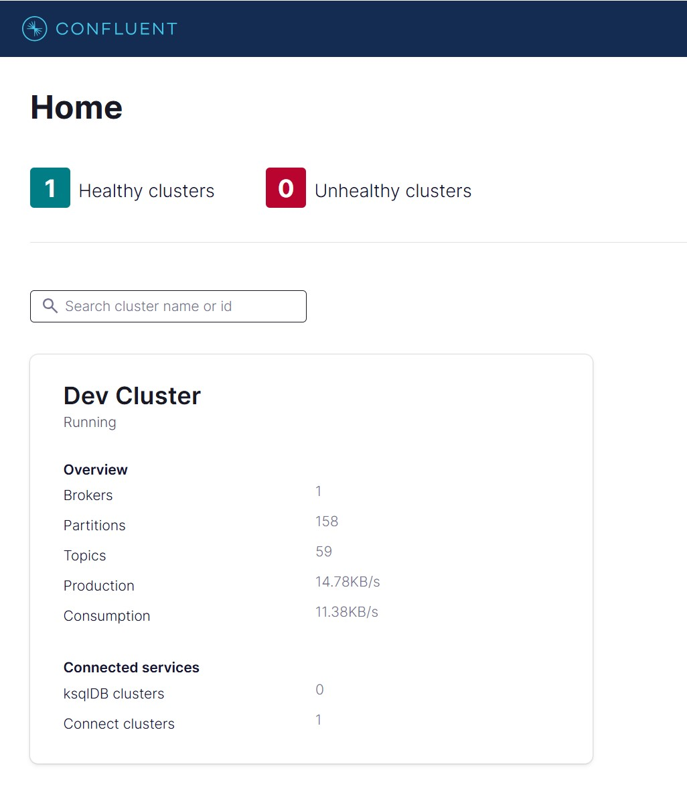

Now if you go inside the controlcenter and select connect from the left panel you can see the connect cluster which is **connect-default**.
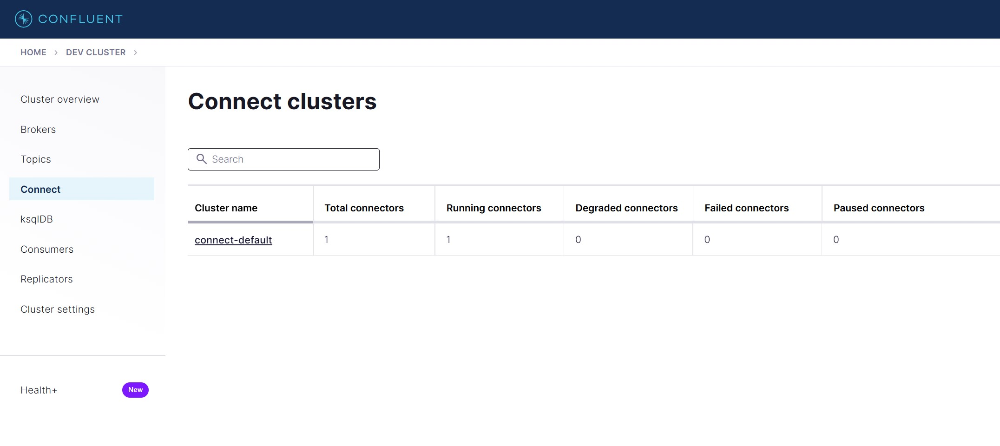

### Populate data into Postgres using Python script. 
The below script is doing the following steps.
- Creating table person in kafkadb 
- Create replication slot for kafkadb
- Create publication slot for kafkadb
- Grant some permission for replicatio & publication slots
- Populate sample date to the database table persons

I use python Faker library to generate some sample data.
```python
import argparse
import psycopg2
from psycopg2 import sql
from faker import Faker
import random
import time

def parse_arguments():
    parser = argparse.ArgumentParser(description="Configure PostgreSQL for CDC and populate with random data.")
    parser.add_argument("--db_name", type=str, default="kafkadb", help="Database name")
    parser.add_argument("--db_user", type=str, default="postgres", help="Database user")
    parser.add_argument("--db_password", type=str, default="password", help="Database password")
    parser.add_argument("--db_host", type=str, default="localhost", help="Database host")
    parser.add_argument("--db_port", type=int, default=5432, help="Database port")
    parser.add_argument("--num_records", type=int, default=50, help="Number of records to insert")
    parser.add_argument("--replication_slot", type=str, default="debezium_slot", help="Replication slot name")
    parser.add_argument("--publication_name", type=str, default="debezium_pub", help="Publication name")
    return parser.parse_args()

# Create database connection
def connect_db(args):
    conn = psycopg2.connect(
        dbname=args.db_name,
        user=args.db_user,
        password=args.db_password,
        host=args.db_host,
        port=args.db_port
    )
    return conn

# Create table if not exists
def create_table(conn):
    with conn.cursor() as cur:
        cur.execute("""
            SELECT EXISTS (
                SELECT FROM information_schema.tables 
                WHERE table_schema = 'public' 
                AND table_name = 'persons'
            );
        """)
        table_exists = cur.fetchone()[0]

        if table_exists:
            print("Table 'persons' already exists.")
        else:
            cur.execute("""
                CREATE TABLE persons (
                    id SERIAL PRIMARY KEY,
                    name VARCHAR(50),
                    surname VARCHAR(50),
                    age INT,
                    gender VARCHAR(10),
                    country VARCHAR(100),
                    email VARCHAR(100)
                )
            """)
            conn.commit()
            print("Table 'persons' created successfully.")

# Grant replication privileges
def grant_replication_privileges(conn, user):
    with conn.cursor() as cur:
        cur.execute(f"ALTER ROLE {user} WITH REPLICATION;")
        conn.commit()
        print(f"Replication privileges granted to user '{user}'.")

# Verify existing replication slot and publication
def verify_setup(conn, slot_name, publication_name):
    with conn.cursor() as cur:
        cur.execute("SELECT slot_name FROM pg_replication_slots WHERE slot_name = %s;", (slot_name,))
        slot_exists = cur.fetchone() is not None

        cur.execute("SELECT pubname FROM pg_publication WHERE pubname = %s;", (publication_name,))
        publication_exists = cur.fetchone() is not None

    return slot_exists, publication_exists

# Create replication slot if not exists
def create_replication_slot(conn, slot_name):
    slot_exists, _ = verify_setup(conn, slot_name, "")
    if slot_exists:
        print(f"Replication slot '{slot_name}' already exists.")
        return

    with conn.cursor() as cur:
        try:
            cur.execute(f"SELECT pg_create_logical_replication_slot('{slot_name}', 'pgoutput');")
            conn.commit()
            print(f"Replication slot '{slot_name}' created successfully.")
        except Exception as e:
            conn.rollback()
            print(f"Error creating replication slot: {e}")

# Create publication if not exists
def create_publication(conn, publication_name):
    _, publication_exists = verify_setup(conn, "", publication_name)
    if publication_exists:
        print(f"Publication '{publication_name}' already exists.")
        return

    with conn.cursor() as cur:
        try:
            cur.execute(f"CREATE PUBLICATION {publication_name} FOR TABLE public.persons;")
            conn.commit()
            print(f"Publication '{publication_name}' created successfully.")
        except Exception as e:
            conn.rollback()
            print(f"Error creating publication: {e}")

# Insert random data
# Insert random data with a 2-second delay
def insert_data(conn, num_records):
    fake = Faker()
    with conn.cursor() as cur:
        for i in range(num_records):
            gender = random.choice(["Male", "Female"])
            name = fake.first_name_male() if gender == "Male" else fake.first_name_female()
            surname = fake.last_name()
            age = fake.random_int(min=18, max=80)
            country = fake.country()
            email = fake.email()

            # Print the data before inserting
            print(f"Inserting {i+1}/{num_records}: Name={name}, Surname={surname}, Age={age}, Gender={gender}, Country={country}, Email={email}")

            cur.execute(
                "INSERT INTO persons (name, surname, age, gender, country, email) VALUES (%s, %s, %s, %s, %s, %s)",
                (name, surname, age, gender, country, email)
            )
            conn.commit()  # Commit after each insert
            time.sleep(1)  # Wait 2 seconds before inserting the next record

    print(f"\nSuccessfully inserted {num_records} records into the database.")

# Main function
def main():
    args = parse_arguments()
    with connect_db(args) as conn:
        try:
            grant_replication_privileges(conn, args.db_user)
            create_table(conn)  # Ensure the table exists before creating publication

            slot_exists, publication_exists = verify_setup(conn, args.replication_slot, args.publication_name)

            if not slot_exists:
                create_replication_slot(conn, args.replication_slot)

            if not publication_exists:
                create_publication(conn, args.publication_name)

            insert_data(conn, args.num_records)
            print(f"Database configured and populated with {args.num_records} records.")
        except Exception as e:
            conn.rollback()
            print(f"Error: {e}")

if __name__ == "__main__":
    main()
```
Now as our postgres database is ready I can start generating data for the persons table. 

```sh
python populate_db.py
```
To verify the data we can login to the database and run the below command. 
```sh
docker exec -it postgres psql -U postgres -d kafkadb
```
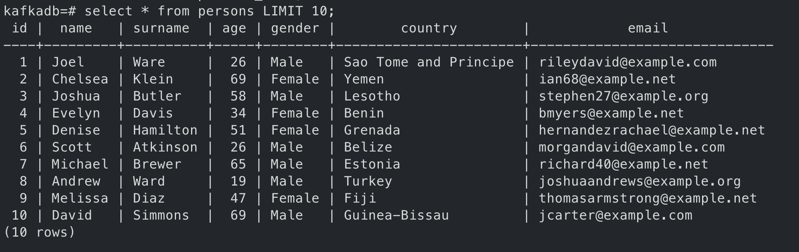

### Postgres Source Connector
So as the data is in the databas now we can deploy the source connector to fetch data from database to the kafka topic. I'm using the Postgres Source Connector for this. Below is the connector defination file `postgres-source-connector.json`

```json
{
  "name": "postgres-source-connector",
  "config": {
    "connector.class": "io.debezium.connector.postgresql.PostgresConnector",
    "database.hostname": "postgres",
    "database.port": "5432",
    "database.user": "postgres",
    "database.password": "password",
    "database.dbname": "kafkadb",
    "database.server.name": "postgres_server",
    "plugin.name": "pgoutput",
    "slot.name": "debezium_slot",
    "publication.name": "debezium_pub",
    "table.include.list": "public.persons",
    "database.history.kafka.bootstrap.servers": "kafka:9092",
    "database.history.kafka.topic": "schema-changes.postgres",
    "topic.prefix": "postgres",

    "key.converter": "org.apache.kafka.connect.json.JsonConverter",
    "key.converter.schemas.enable": true,
    "value.converter": "org.apache.kafka.connect.json.JsonConverter",
    "value.converter.schemas.enable": true,

    "transforms": "unwrap",
    "transforms.unwrap.type": "io.debezium.transforms.ExtractNewRecordState",
    "transforms.unwrap.drop.tombstones": "true",
    "transforms.unwrap.delete.handling.mode": "rewrite"
  }
}
```
Now to register the connector defination file to the connect cluster using below rest call. 
```sh
curl -X POST http://localhost:8083/connectors -H "Content-Type: application/json" -d @postgres-source-connector.json
```
Now it should be visible under the connect server in the control center
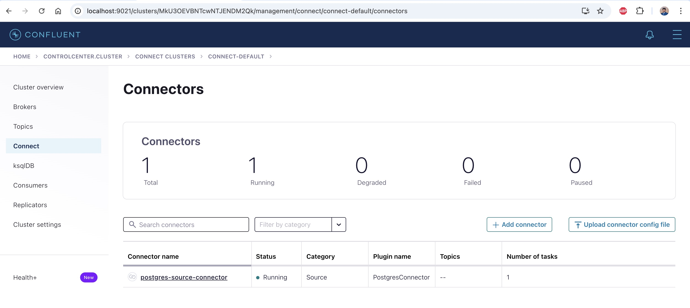

Also if we check in the cluster topics section there should be topics `postgres.public.persons` where the data from postgres should stored. If we check the message section of this topic we can see the data.
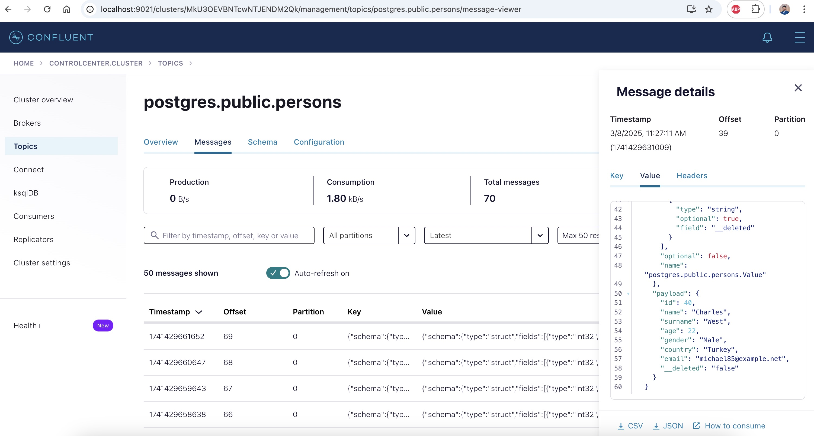

### JDBC Sink Connector
Now we are going to use sink connector to push the data back to another table (persons_sink) in the databse. Normally there are some transformation is done but I'm skipping this to keep this simple. For sink connector here is the defination file `jdbc-sink-connector.json`. 
```json
{
  "name": "jdbc-sink-connector",
  "config": {
    "connector.class": "io.confluent.connect.jdbc.JdbcSinkConnector",
    "connection.url": "jdbc:postgresql://postgres:5432/kafkadb",
    "connection.user": "postgres",
    "connection.password": "password",
    "topics": "postgres.public.persons",
    "table.name.format": "public.persons_sink",
    "auto.create": "true",
    "auto.evolve": "true",
    "insert.mode": "upsert",
    "pk.fields": "id",
    "pk.mode": "record_key",
    "delete.enabled": "false",
    "key.converter": "org.apache.kafka.connect.json.JsonConverter",
    "key.converter.schemas.enable": true,
    "value.converter": "org.apache.kafka.connect.json.JsonConverter",
    "value.converter.schemas.enable": true
  }
}
```

Let's deploy the this sink connector via the connector rest api.
```sh
curl -X POST http://localhost:8083/connectors -H "Content-Type: application/json" -d @jdbc-sink-connector.json
```
In the control center connect section now there are 2 connectors should be visible like below. 
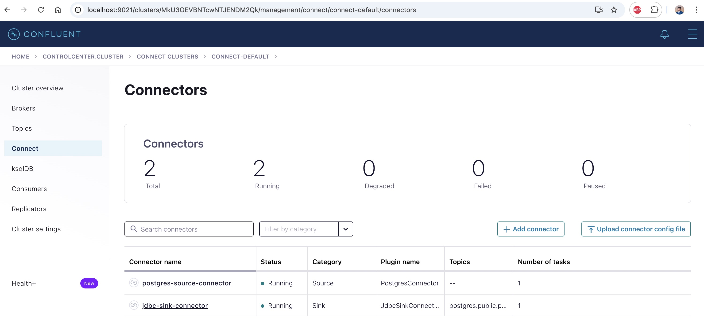

To verify the data is pushed back from topic to the database let's login to postgres and check using the below command
```sh
docker exec -it postgres psql -U postgres -d kafkadb
```

check the databse data using below command. 
```sql
kafkadb=# select * from persons LIMIT 10;
kafkadb=# select * from persons_sink LIMIT 10;
```
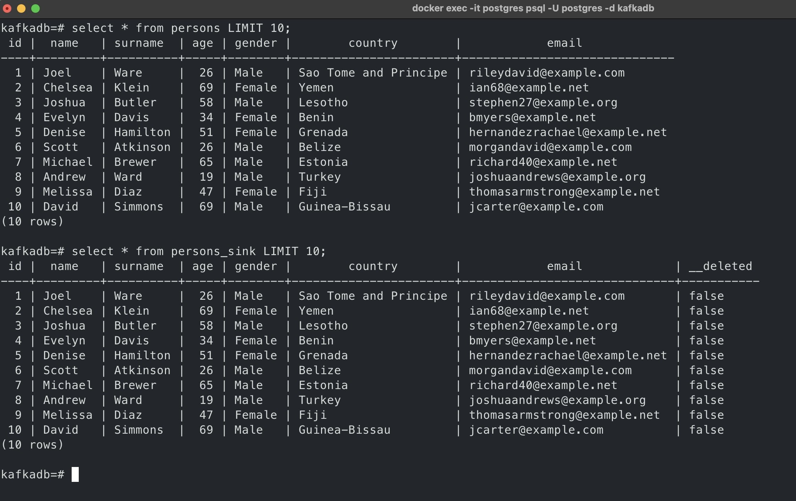

Also I wrote a python script to verify the data between 2 tables of kafka db i.e. `persons` & `persons_sink`
```python
import psycopg2
from psycopg2.extras import DictCursor

def fetch_data(cursor, table_name):
    query = f"""
        SELECT id, name, surname, age, gender, country, email
        FROM {table_name}
        ORDER BY id;
    """
    cursor.execute(query)
    return cursor.fetchall()

def compare_tables(conn):
    with conn.cursor(cursor_factory=DictCursor) as cursor:
        persons_data = fetch_data(cursor, "persons")
        persons_sink_data = fetch_data(cursor, "persons_sink")

        persons_dict = {row['id']: row for row in persons_data}
        persons_sink_dict = {row['id']: row for row in persons_sink_data}

        mismatches = []
        match_count = 0
        all_ids = set(persons_dict.keys()).union(set(persons_sink_dict.keys()))

        for i, id_ in enumerate(all_ids, start=1):
            row1 = persons_dict.get(id_)
            row2 = persons_sink_dict.get(id_)

            if row1 != row2:
                mismatches.append((id_, row1, row2))
            else:
                match_count += 1
                if match_count % 10 == 0:
                    print(f"Matched {match_count} records so far...")

        return mismatches

def main():
    conn = psycopg2.connect(
        dbname="kafkadb",
        user="postgres",
        password="password",
        host="localhost",
        port="5432"
    )

    try:
        mismatches = compare_tables(conn)
        if mismatches:
            print("Mismatched records found:")
            for id_, row1, row2 in mismatches:
                print(f"ID: {id_}")
                print("Persons Table:", dict(row1) if row1 else "Missing")
                print("Persons Sink Table:", dict(row2) if row2 else "Missing")
                print("-" * 40)
        else:
            print("All records match between 2 tables!")
    finally:
        conn.close()

if __name__ == "__main__":
    main()

```

We can also use the more api call to list the connectors and some more details like below
```sh
http://localhost:8083/connectors/
http://localhost:8083/connectors/postgres-source-connector
http://localhost:8083/connectors/postgres-source-connector/status
http://localhost:8083/connectors/postgres-source-connector/config
```
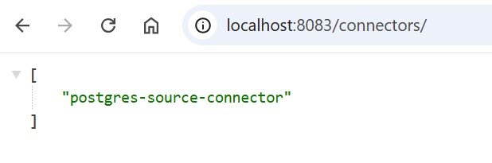
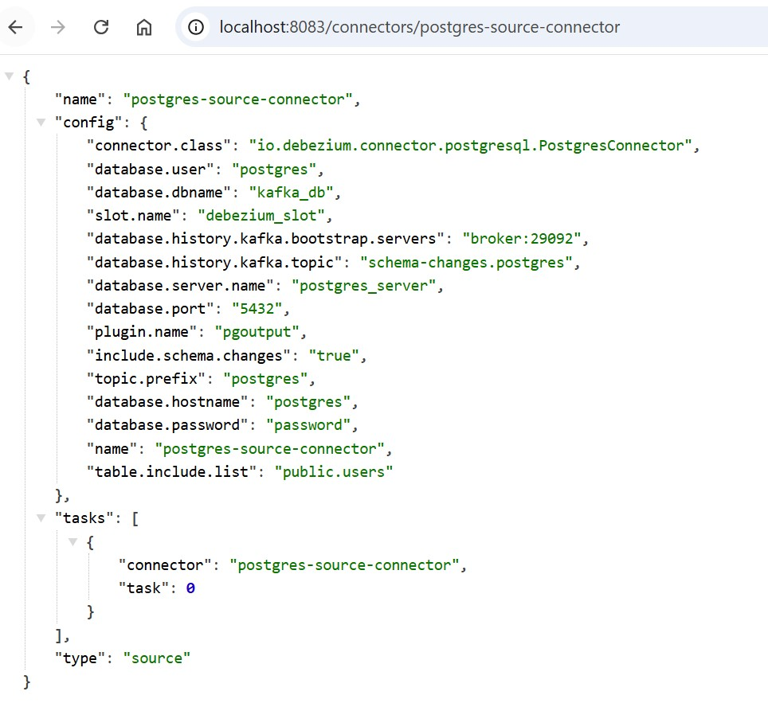
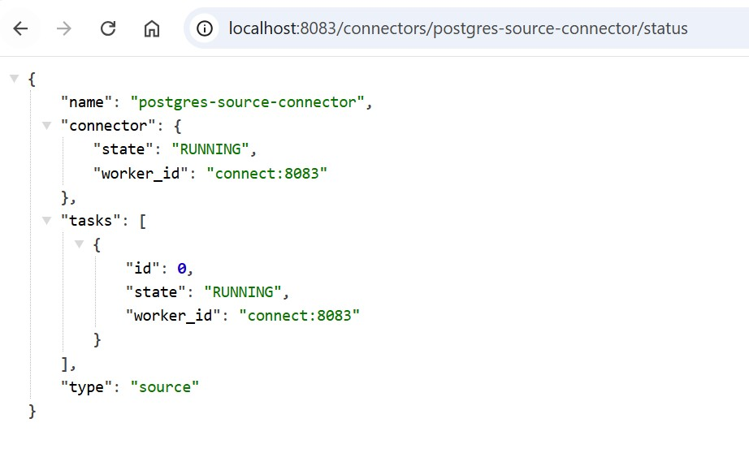
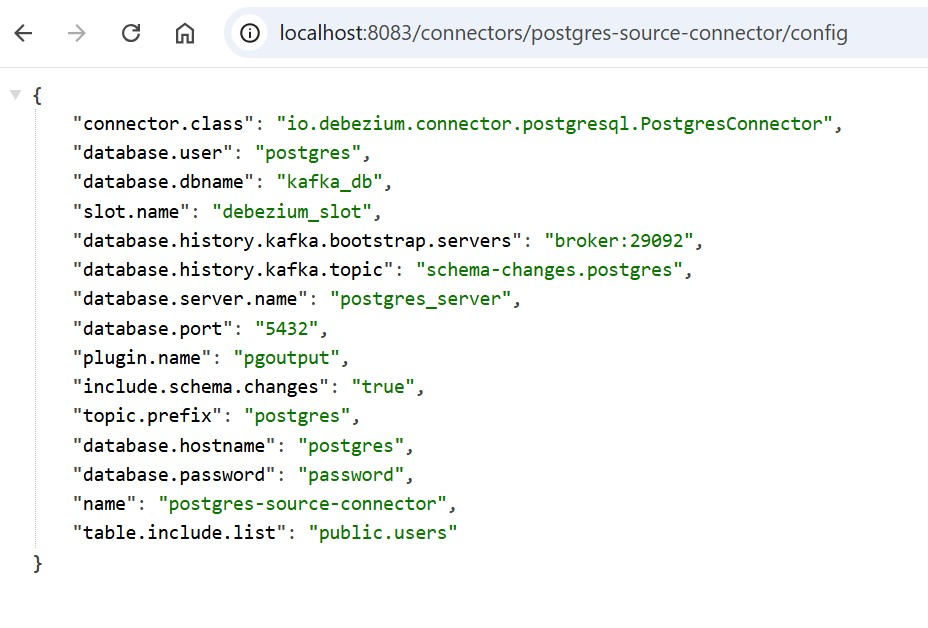

### Thank you !