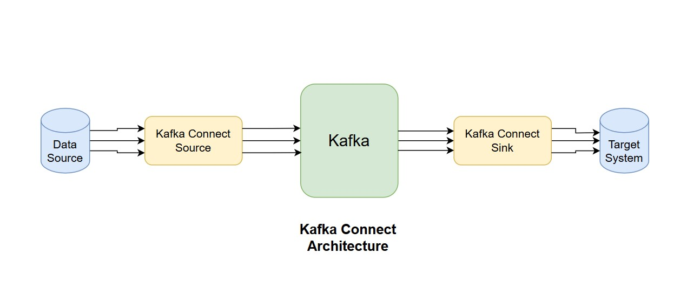
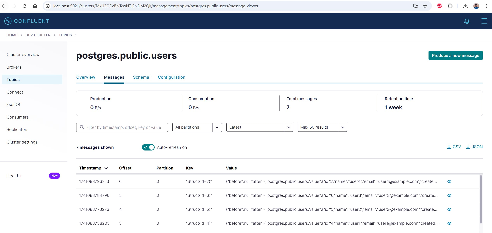

## This is a practice to implement Kafka-Connect End-to-End

### Creating docker-compose file to create local kafka cluster
For the local cluster I am using kafka kraft mode and below components 
- One controller,kafka instance
- One schema-registry
- One kafka-connect
- One control-center 
- One postgres db instance

The architecure diagram should be like this 


below is the docker-compose file which I used. 

```yml
name: 'streaming'

services:

  broker:
    image: confluentinc/cp-server:7.9.0
    hostname: broker
    container_name: broker
    ports:
      - "9092:9092"
      - "9101:9101"
    environment:
      KAFKA_NODE_ID: 1
      KAFKA_LISTENER_SECURITY_PROTOCOL_MAP: 'CONTROLLER:PLAINTEXT,PLAINTEXT:PLAINTEXT,PLAINTEXT_HOST:PLAINTEXT'
      KAFKA_ADVERTISED_LISTENERS: 'PLAINTEXT://broker:29092,PLAINTEXT_HOST://localhost:9092'
      KAFKA_OFFSETS_TOPIC_REPLICATION_FACTOR: 1
      KAFKA_GROUP_INITIAL_REBALANCE_DELAY_MS: 0
      KAFKA_CONFLUENT_LICENSE_TOPIC_REPLICATION_FACTOR: 1
      KAFKA_CONFLUENT_BALANCER_TOPIC_REPLICATION_FACTOR: 1
      KAFKA_TRANSACTION_STATE_LOG_MIN_ISR: 1
      KAFKA_TRANSACTION_STATE_LOG_REPLICATION_FACTOR: 1
      KAFKA_JMX_PORT: 9101
      KAFKA_JMX_HOSTNAME: localhost
      KAFKA_CONFLUENT_SCHEMA_REGISTRY_URL: http://schema-registry:8081
      KAFKA_METRIC_REPORTERS: io.confluent.metrics.reporter.ConfluentMetricsReporter
      CONFLUENT_METRICS_REPORTER_BOOTSTRAP_SERVERS: broker:29092
      CONFLUENT_METRICS_REPORTER_TOPIC_REPLICAS: 1
      KAFKA_PROCESS_ROLES: 'broker,controller'
      KAFKA_CONTROLLER_QUORUM_VOTERS: '1@broker:29093'
      KAFKA_LISTENERS: 'PLAINTEXT://broker:29092,CONTROLLER://broker:29093,PLAINTEXT_HOST://0.0.0.0:9092'
      KAFKA_INTER_BROKER_LISTENER_NAME: 'PLAINTEXT'
      KAFKA_CONTROLLER_LISTENER_NAMES: 'CONTROLLER'
      KAFKA_LOG_DIRS: '/tmp/kraft-combined-logs'
      CONFLUENT_METRICS_ENABLE: 'true'
      CONFLUENT_SUPPORT_CUSTOMER_ID: 'anonymous'
      CLUSTER_ID: 'MkU3OEVBNTcwNTJENDM2Qk'
    networks:
      - streaming-network

  schema-registry:
    image: confluentinc/cp-schema-registry:7.9.0
    hostname: schema-registry
    container_name: schema-registry
    depends_on:
      - broker
    ports:
      - "8081:8081"
    environment:
      SCHEMA_REGISTRY_HOST_NAME: schema-registry
      SCHEMA_REGISTRY_KAFKASTORE_BOOTSTRAP_SERVERS: 'broker:29092'
      SCHEMA_REGISTRY_LISTENERS: http://0.0.0.0:8081
    networks:
      - streaming-network    

  connect:
    image: confluentinc/cp-kafka-connect:7.9.0
    hostname: connect
    container_name: connect
    depends_on:
      - broker
      - schema-registry
    ports:
      - "8083:8083"
    environment:
      CONNECT_BOOTSTRAP_SERVERS: 'broker:29092'
      CONNECT_REST_ADVERTISED_HOST_NAME: connect
      CONNECT_GROUP_ID: compose-connect-group
      CONNECT_CONFIG_STORAGE_TOPIC: docker-connect-configs
      CONNECT_CONFIG_STORAGE_REPLICATION_FACTOR: 1
      CONNECT_OFFSET_FLUSH_INTERVAL_MS: 10000
      CONNECT_OFFSET_STORAGE_TOPIC: docker-connect-offsets
      CONNECT_OFFSET_STORAGE_REPLICATION_FACTOR: 1
      CONNECT_STATUS_STORAGE_TOPIC: docker-connect-status
      CONNECT_STATUS_STORAGE_REPLICATION_FACTOR: 1
      CONNECT_KEY_CONVERTER: org.apache.kafka.connect.storage.StringConverter
      CONNECT_VALUE_CONVERTER: io.confluent.connect.avro.AvroConverter
      CONNECT_VALUE_CONVERTER_SCHEMA_REGISTRY_URL: http://schema-registry:8081
      CONNECT_PLUGIN_PATH: "/usr/share/java,/usr/share/confluent-hub-components"
    command: ["sh", "-c", "
      confluent-hub install --no-prompt debezium/debezium-connector-postgresql:latest && 
      confluent-hub install --no-prompt confluentinc/kafka-connect-jdbc:latest && 
      /etc/confluent/docker/run"]
    networks:
      - streaming-network

  control-center:
    image: confluentinc/cp-enterprise-control-center:7.9.0
    hostname: control-center
    container_name: control-center
    depends_on:
      - broker
      - schema-registry
      - connect
    ports:
      - "9021:9021"
    environment:
      CONTROL_CENTER_BOOTSTRAP_SERVERS: 'broker:29092'
      CONTROL_CENTER_CONNECT_CONNECT-DEFAULT_CLUSTER: 'connect:8083'
      CONTROL_CENTER_CONNECT_HEALTHCHECK_ENDPOINT: '/connectors'
      CONTROL_CENTER_SCHEMA_REGISTRY_URL: "http://schema-registry:8081"
      CONTROL_CENTER_REPLICATION_FACTOR: 1
      CONTROL_CENTER_INTERNAL_TOPICS_PARTITIONS: 1
      CONTROL_CENTER_MONITORING_INTERCEPTOR_TOPIC_PARTITIONS: 1
      CONFLUENT_METRICS_TOPIC_REPLICATION: 1
      PORT: 9021
    networks:
      - streaming-network

  postgres:
    image: postgres:16
    hostname: postgres
    container_name: postgres
    ports:
      - "5432:5432"
    environment:
      POSTGRES_USER: postgres
      POSTGRES_PASSWORD: password
      POSTGRES_DB: kafka_db
    volumes:
      - postgres_data:/var/lib/postgresql/data
    command: [ "postgres", "-c", "wal_level=logical" ]
    networks:
      - streaming-network

volumes:
  postgres_data:

networks:
  streaming-network:
    driver: bridge
```

You can replace the cluster id by using the following command and replace it with the existing one. 
```sh
docker run --rm confluentinc/cp-server:7.9.0 kafka-storage random-uuid
```

Let's spin-up the cluster 
```sh
docker compose up -d 
```
If you go to browser with http://localhost:9021 you can see the control center GUI like this.


Now if you go inside the controlcenter and select connect from the left panel you can see the connect cluster which is **connect-default**.


If you select this connect cluster then we can see our running connectors which running in it.
 

We can also use the more api call to list the connectors and some more details like below
```sh
http://localhost:8083/connectors/
http://localhost:8083/connectors/postgres-source-connector
http://localhost:8083/connectors/postgres-source-connector/status
http://localhost:8083/connectors/postgres-source-connector/config
```


### Postgres Settings
Before starting on the kafka connect part we need to do few changes on the postgres level to make it work with CDC(Change data capture).

Open a shell inside the PostgreSQL container:
```sh
docker exec -it postgres psql -U postgres -d kafka_db
```
Run the following SQL commands:
```sql
-- Configure max_replication_slots and max_wal_senders 
ALTER SYSTEM SET max_replication_slots = 5;
ALTER SYSTEM SET max_wal_senders = 5;
SELECT pg_reload_conf();

-- Create a replication slot
SELECT * FROM pg_create_logical_replication_slot('debezium_slot', 'pgoutput');

-- Create a sample table for testing
CREATE TABLE users (
    id SERIAL PRIMARY KEY,
    name TEXT NOT NULL,
    email TEXT NOT NULL UNIQUE,
    created_at TIMESTAMP DEFAULT CURRENT_TIMESTAMP
);

-- Insert test data
INSERT INTO users (name, email) VALUES 
('user1', 'user1@example.com'),
('user2', 'user2@example.com');
```

Now we need to create a connector configuration json file postgres-source-connector.json. 
```json
{
  "name": "postgres-source-connector",
  "config": {
    "connector.class": "io.debezium.connector.postgresql.PostgresConnector",
    "database.hostname": "postgres",
    "database.port": "5432",
    "database.user": "postgres",
    "database.password": "password",
    "database.dbname": "kafka_db",
    "database.server.name": "postgres_server",
    "topic.prefix": "postgres",
    "plugin.name": "pgoutput",
    "slot.name": "debezium_slot",
    "table.include.list": "public.users",
    "database.history.kafka.bootstrap.servers": "broker:29092",
    "database.history.kafka.topic": "schema-changes.postgres",
    "include.schema.changes": "true"
  }
}
```
Now we need to register this to the connect server using the below command. 
```sh
curl.exe -X POST http://localhost:8083/connectors -H "Content-Type: application/json" -d @postgres-source-connector.json
```
Now to check the status of the connectors we can use the below command
```sh
curl.exe http://localhost:8083/connectors/postgres-source-connector/status
```
Now to check this realtime CDC lets open a db session and try to add some data. Before that lets open the associates topic in controlcenter where the data will be visible.
```sh
docker exec -it postgres psql -U postgres -d kafka_db
```
```sql
kafka_db=# INSERT INTO users (name, email) VALUES ('user2', 'user1@example.com');
kafka_db=# INSERT INTO users (name, email) VALUES ('user2', 'user2@example.com');
kafka_db=# INSERT INTO users (name, email) VALUES ('user3', 'user3@example.com');
kafka_db=# INSERT INTO users (name, email) VALUES ('user4', 'user4@example.com');
```
In the controlcenter topic we can see the data is being fetched in realtime from db to the topics by the connector


## Sink Connector Configuration 
Now using the sink connector we need to get the data from the kafka topic and then send it back to a new table of the same postgres instance.

#### Create a table in PostgreSQL that matches the data structure from Kafka.
```sql
CREATE TABLE users_sink (
    id SERIAL PRIMARY KEY,
    name TEXT,
    email TEXT,
    created_at TIMESTAMP
);
```
Now we need to create a sink connector defination file i.e. postgres-sink-connector.json
```json
{
  "name": "postgres-sink-connector",
  "config": {
    "connector.class": "io.confluent.connect.jdbc.JdbcSinkConnector",
    "tasks.max": "1",
    "topics": "postgres.public.users",
    "connection.url": "jdbc:postgresql://postgres:5432/kafka_db",
    "connection.user": "postgres",
    "connection.password": "password",
    "auto.create": "true",
    "auto.evolve": "true",
    "insert.mode": "upsert",
    "pk.mode": "record_value",
    "pk.fields": "id",
    "delete.enabled": "false"
  }
}
```
